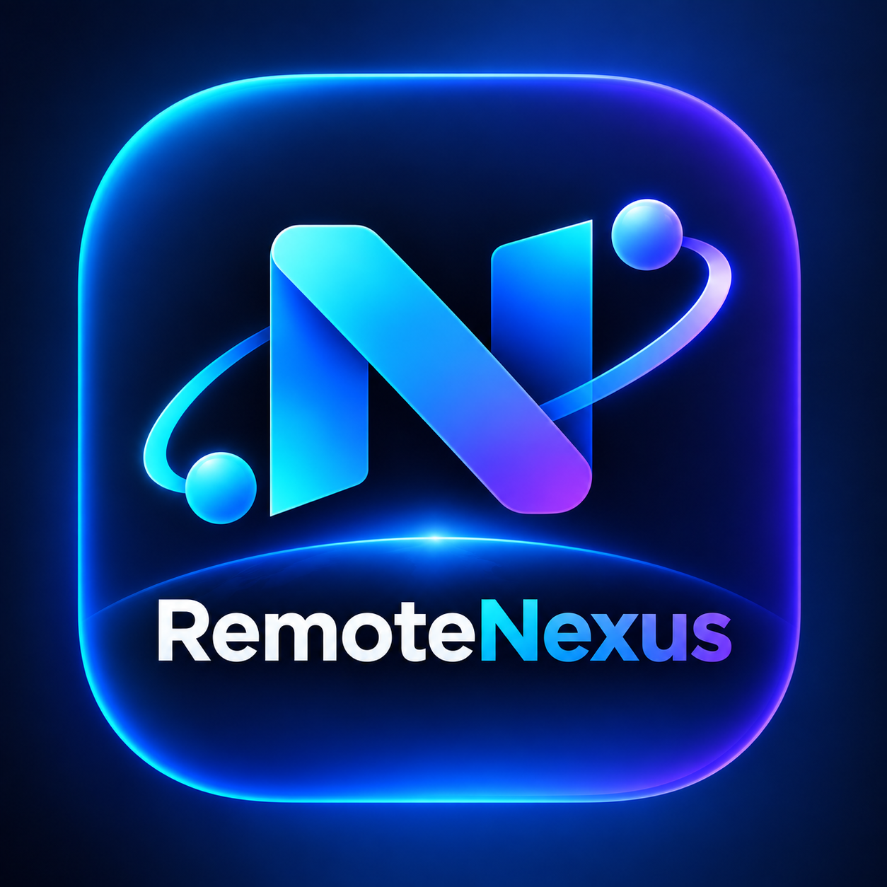
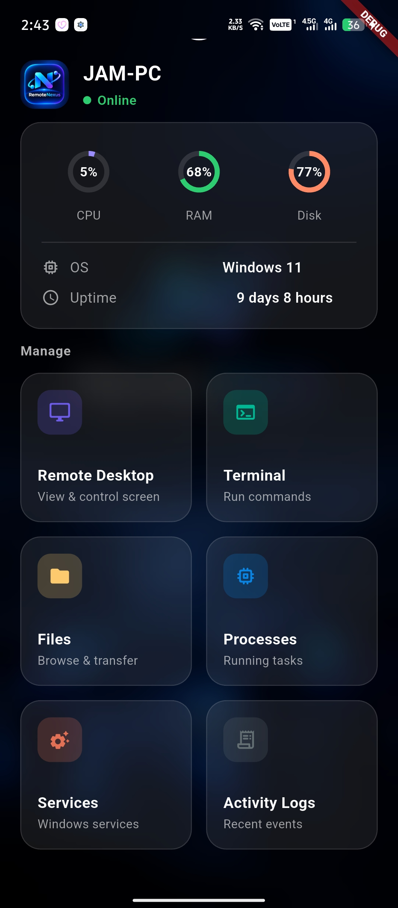
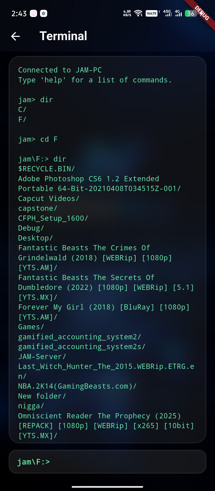
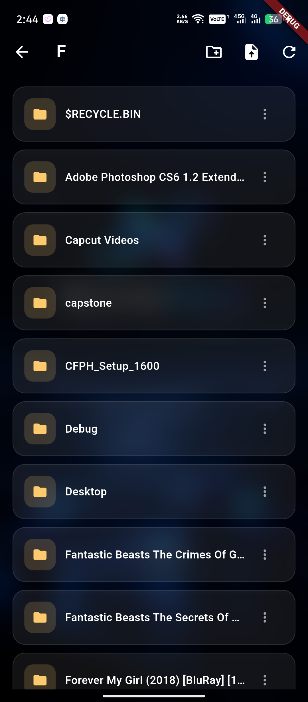
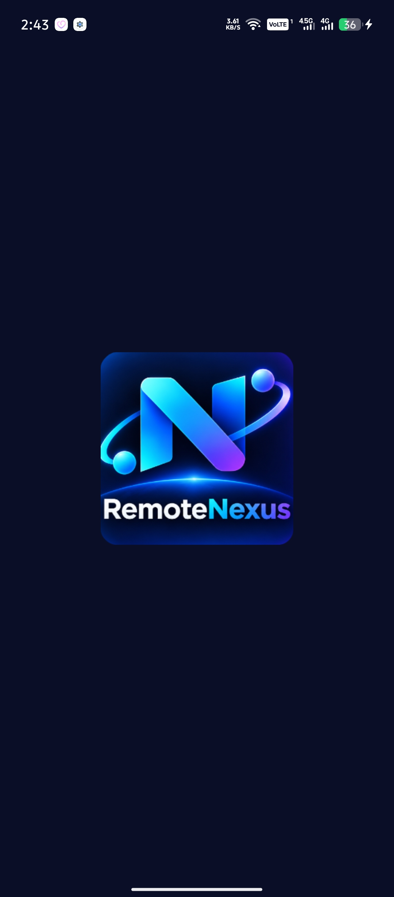

<p align="center">
  
</p>

<h1 align="center">RemoteNexus</h1>

<p align="center">A remote-management app for controlling a Windows PC from Android — terminal, file manager, system monitor, and full remote desktop control, over LAN or the internet.</p>

<p align="center">
  
  
  
  
</p>

## What it does

- **Remote Desktop** — live screen streaming (WebSocket + JPEG frames) with full mouse/keyboard control, adjustable quality (Low/Medium/High) and FPS (15/30/60)
- **Terminal** — a controlled, shell-like command router (`cd`, `pwd`, `dir`/`ls`, `mkdir`) with real per-session working-directory tracking
- **File Manager** — browse, upload, download, rename, delete, across multiple configured drives (`C:`, `F:`, etc.), with path-traversal protection per drive
- **System Monitor** — live CPU / RAM / storage / uptime / network / server info
- **Process & Service Monitor** — running processes, and status of key Windows services (Spooler, W32Time, WinDefend)
- **Activity Logs** — every pairing, download, and upload is logged with a timestamp (tokens/passwords are never logged)
- **Secure Pairing** — first-time devices request access via a 6-digit code; the PC operator approves/denies from the console; an auth token is then issued and stored securely on the phone
- **Local & Remote modes** — works fully offline over LAN/hotspot, or over the internet via a Cloudflare Tunnel (no ports forwarded, no direct exposure)

## Tech stack

| Layer | Tech |
|---|---|
| Mobile client | Flutter (Android), Dart |
| Agent | Python 3, FastAPI, Uvicorn |
| Communication | HTTP REST + WebSocket |
| Screen capture | `mss`, `pyautogui`, Pillow |
| System info | `psutil` |
| Secure storage | `flutter_secure_storage` |

## Project structure

```
jam_remote/
├── jam_agent/          # Python/FastAPI Windows agent
│   ├── main.py
│   ├── config/
│   │   └── config.json
│   └── app/
│       ├── routes/     # connection, auth, system, terminal, files, processes, services, logs, remote_desktop
│       ├── services/   # matching business logic per route
│       ├── authentication.py
│       ├── config.py
│       └── logging_config.py
└── jam_remote/          # Flutter Android app
    └── lib/
        ├── main.dart
        ├── screens/     # connection, pairing, system (dashboard), terminal, files, processes, services, logs, remote_desktop
        └── services/    # connection, authentication, terminal, file, system, remote_desktop, storage
```

## Setup

### Windows agent

```bash
cd jam_agent
pip install -r requirements.txt
python main.py
```

Configure `config/config.json` first — set `shared_drives` to the drive roots you want exposed, and `computer_name`/`port` as needed. `remote_access_enabled` stays `false` unless you're using a tunnel.

### Flutter app

```bash
cd jam_remote
flutter pub get
flutter run
```

On first connection, the Windows console will show a pairing request — approve it with `allow <id>` to issue the phone a token.

## Development phases

Built incrementally, one phase at a time:

1. **Connection** — `/api/health` LAN handshake
2. **Pairing/Auth** — 6-digit code, console approval, secure token
3. **System Info** — CPU/RAM/storage/uptime/network
4. **Terminal** — controlled command router
5. **File Manager** — browse/upload/download/rename/delete
6. **Monitoring** — processes, services, activity logs
7. **Remote Desktop** — WebSocket screen streaming + input control
8. **Remote Internet Mode** — Cloudflare Tunnel (paused — see below)

## ⚠️ Can be improved soon

Known rough edges and unfinished pieces — good next steps if picking this back up:

- **Permanent tunnel domain** — Phase 8 currently relies on Cloudflare's free quick-tunnel URLs, which are random and change every restart. A named tunnel with a free domain (e.g. via DigitalPlat FreeDomain → Cloudflare nameservers) would give a fixed address instead of grabbing a fresh URL each time.
- **Multi-monitor switching** — the backend already supports a `set_monitor` event, but there's no UI button wired up in the Remote Desktop screen yet.
- **Clipboard sync** — no Android ↔ Windows clipboard bridge yet.
- **Packaged agent** — the Windows agent still runs via `python main.py`; packaging it as a standalone `JAM-Agent.exe` (PyInstaller or similar) would remove the Python dependency for end users.
- **Auth token expiry** — tokens currently never expire; they're valid until the device is manually revoked. Consider adding expiry/rotation for a higher security bar, especially now that File Manager/Terminal have full-drive access rather than a sandboxed folder.
- **Splash screen** — native splash was attempted via `flutter_launcher_icons` but skipped due to a Gradle/network timeout; worth revisiting.
- **Security note** — since file/terminal access was widened from a sandboxed folder to full configured drives, the pairing token is now a high-value credential (full read/write/delete across the whole drive). Fine for trusted personal/LAN use, but worth hardening (token expiry, maybe per-drive permissions) before ever combining this with Remote Internet Mode.

## Security principles

This app is built for devices the user owns or has explicitly authorized. It does **not** implement stealth access, hidden persistence, credential theft, keylogging, or covert monitoring. The Windows agent always visibly indicates when it's running, requires explicit device authorization, and never exposes the full filesystem or the raw agent port to the public internet without a secure relay layer.